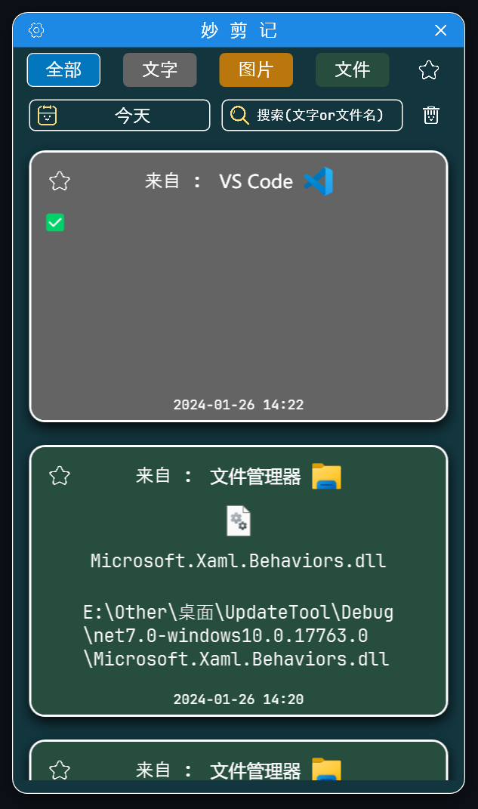
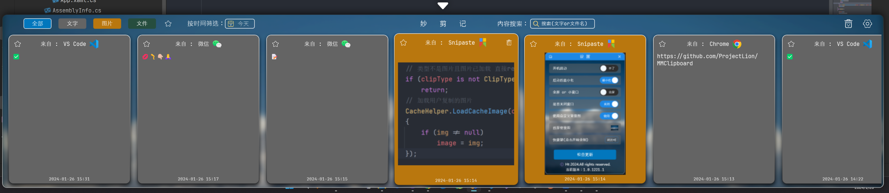
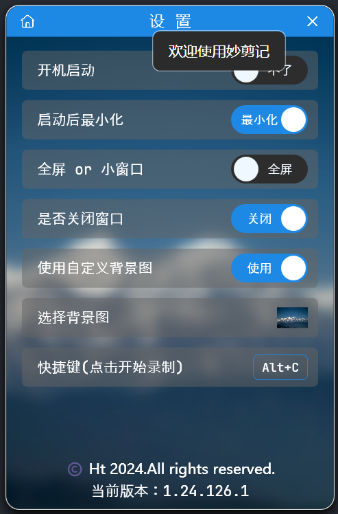

<h1 align="center">妙剪记</h1>

这是一款漂亮的(自认为的🤣)Windows桌面端剪切板历史记录软件，目前支持**文本**、**图片**、**文件**的复制/剪切记录，所有数据均保存到本地数据库中，你的数据你自己掌控，**我们不会上传你的任何数据至云端**。

### 🍋功能介绍
- 🍑记录你的剪贴板历史✅
  - 记录中将显示该条数据是从什么软件复制来的✅
- 🍓横向排列和竖向排列两种方式✅
- 🍒记录内容数据类型✅
  - 文本✅
    - 如果复制的文本是网页地址，可直接右键打开该页面，程序自动识别内容✅
    - 如果是本地文件(夹)地址，可右键打开该目录✅
  - 支持Emoji内容显示✅
    - 暂不支持微信自己的表情包，复制出来是空的~❌
  - 图片✅
    - 截图软件生成的图片会保存一份到程序Cache目录中，删除数据条目时一并删除✅
  - 文件✅
- 🍆数据筛选✅
  - 按日期✅
  - 按类型✅
  - 是否收藏✅
- 🥑收藏记录✅
- 🥕搜索✅
  - 文本内容✅
  - 文件名✅
- 🍄一键清空所选日期的所有数据✅
- 🌰开机启动(默认开启)✅
- 🥒自定义窗口背景图(色)✅
- 🌽自定义快捷键✅

### 🦤计划加入功能
- App在线更新
- 快捷短语
- 更丰富的右键菜单

### 🎃下载
- 无网络情况的用户请移步至 [Releases](https://github.com/ProjectLion/MMClipboard/releases) 下载安装包or压缩包后安装使用。
- 存在网络情况的朋友请移步至 [Gitee](https://gitee.com/HtReturnTrue/MMClipboard) 或者直达 [Releases](https://gitee.com/HtReturnTrue/MMClipboard/releases) 下载安装包or压缩包后安装使用。

### 🖥️使用环境
- Windows10.0.17763.0 later✅
- Windows11所有版本✅

### 🔧使用
**安装后双击运行程序即开启监听，使用你定义的快捷键(默认Alt+C)呼出记录窗口点击相应的记录即可粘贴到你当前鼠标光标处**

### 🔧使用过程中出现问题的解决办法
- **如果出现无法监听复制内容的情况，请右下角退出App后以管理员方式运行**
- **如果出现无法粘贴内容，可能是粘贴目的地不支持该数据格式，如VS Code中不支持插入图片**
- 如果你是一名开发者，有新的想法，欢迎 [fork](https://github.com/ProjectLion/MMClipboard/forks) 本项目并发起 [PR](https://github.com/ProjectLion/MMClipboard/pulls)，我将把你的名字写入贡献者名单
- 其他问题请提 [Issues](https://github.com/ProjectLion/MMClipboard/issues)，我会尽快解决问题。

### 📸应用截图
  - 竖屏(小窗口)
  
  - 横屏
  
  - 设置页面
  

## 🙏致谢 
#### 感谢以下无私奉献的开源库的作者和贡献者们(排名不分先后)
- C# Zip解压缩支持库 - [__SharpZipLib__](https://github.com/icsharpcode/SharpZipLib)
- WPF Emoji表情包支持库 - [__Emoji.Wpf__](https://github.com/samhocevar/emoji.wpf)
- C# Json解析支持库 - [__Newtonsoft.Json__](https://github.com/JamesNK/Newtonsoft.Json)
- C# SQLite ORM支持库 - [__FreeSql__](https://github.com/dotnetcore/FreeSql)
- WPF Theme、UI组件工具包 - [__MaterialDesignThemes__](https://github.com/MaterialDesignInXAML/MaterialDesignInXamlToolkit)
- WPF MVVM工具包 - [__CommunityToolkit.Mvvm__](https://github.com/CommunityToolkit/dotnet)
- WPF 系统托盘图标工具包 - [__Hardcodet.NotifyIcon.Wpf__](https://github.com/hardcodet/wpf-notifyicon)
- WPF xaml行为事件工具包 - [__Microsoft.Xaml.Behaviors.Wpf__](https://github.com/Microsoft/XamlBehaviorsWpf)
- WPF 内存释放工具包 - [__Lierda.WPFHelper__](https://www.nuget.org/packages/Lierda.WPFHelper)

## ❗免责声明
**禁止任何人以任何形式将其用于任何非法用途，对于使用该程序所造成的任何后果，所有创作者不承担任何责任。**
**该软件不存在任何收费，谨防上当受骗。**
**软件贩子勿扰，违规违法勿扰，二次开发请务必遵守开源协议。**

### 🤙联系我
- 本项目只支持Github的 [__Issues__](https://github.com/ProjectLion/MMClipboard/issues) 交流，没有Q群。

### 🏅支持该项目
感谢你对本项目的支持，在你觉得本项目对你有帮助的前提下，愿意提供赞助我将非常感激。

### ✨赞助方式

# License

MMClipboard is licensed under [MIT License](./LICENSE).

Copyright © 2023-2024 by Ht.
